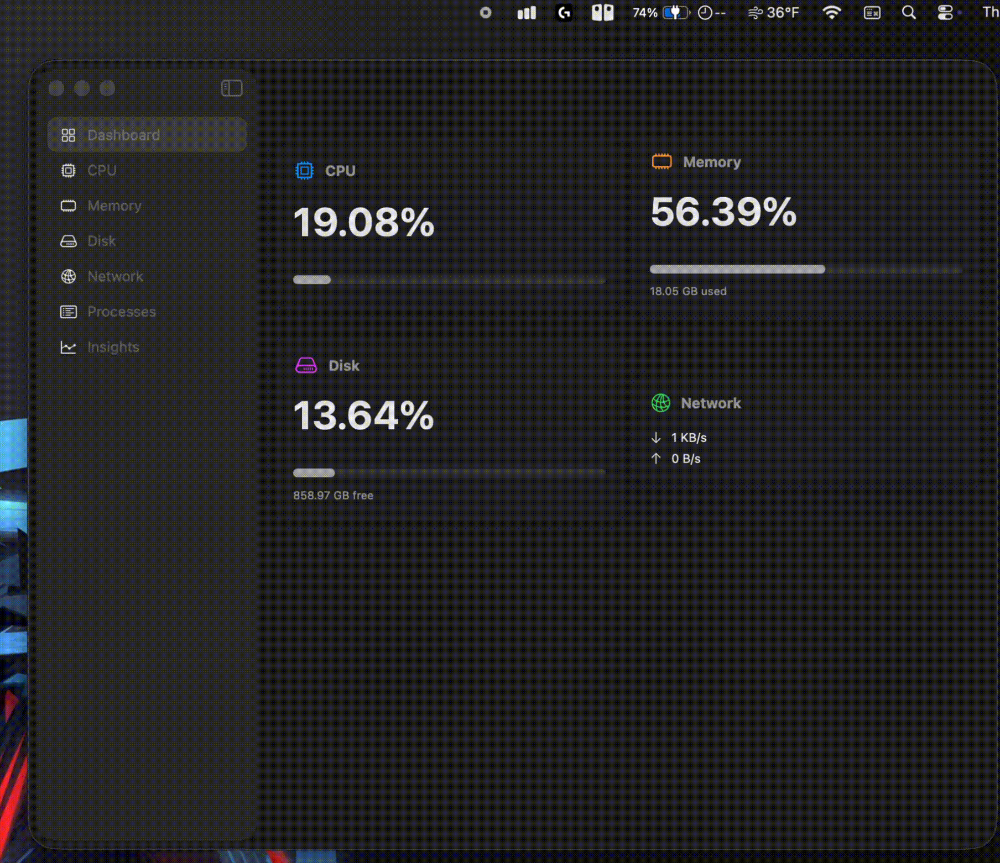
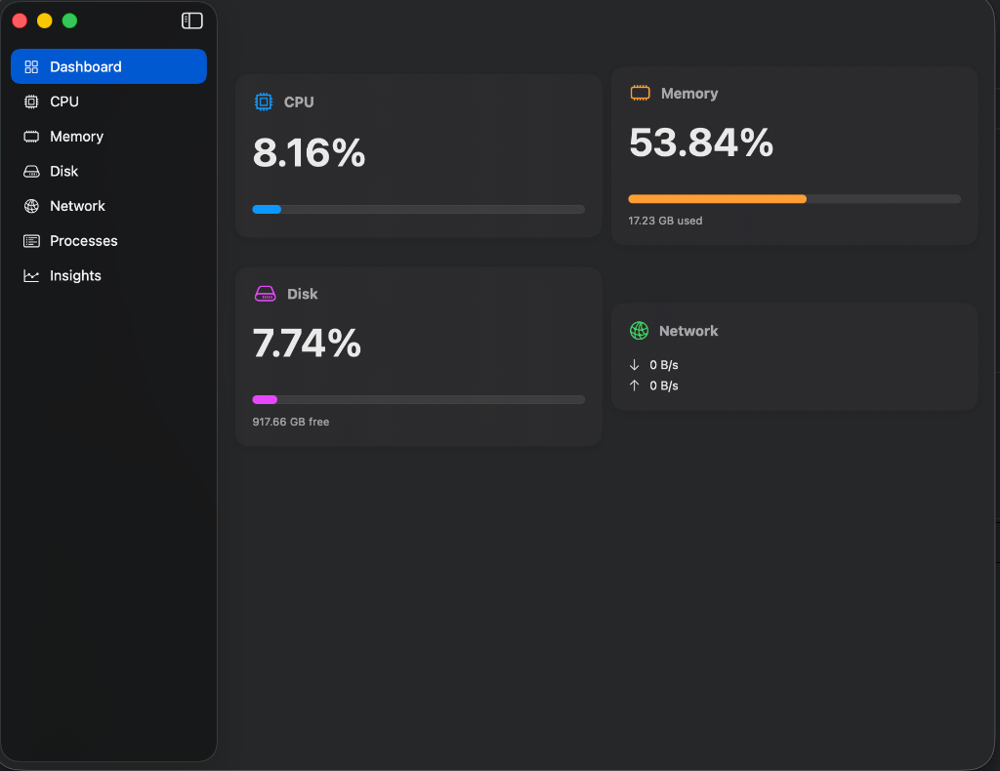

<div align="center">

# 📊 Stat Check
### A native macOS system monitor + process manager built with SwiftUI

[](https://www.apple.com/macos)
[](https://swift.org)
[](LICENSE)
[](https://github.com/Haadesx/Stat-Checker/releases)

<br />

Built a native macOS performance monitor and process manager with per-core CPU, memory, network, and disk metrics, real-time charting (Swift Charts), and process inspection via low-level macOS APIs.

[**Download Now**](https://github.com/Haadesx/Stat-Checker/releases/latest) · [Report Bug](https://github.com/Haadesx/Stat-Checker/issues) · [Request Feature](https://github.com/Haadesx/Stat-Checker/issues)

</div>

---

## ✨ Features

### 🚀 Real-Time Monitoring
Real-time monitoring for key system metrics with smooth charting.
*   **CPU**: Detailed load analysis with per-core breakdown.
*   **Memory**: Precise RAM usage tracking with dynamic scaling charts.
*   **Network**: Live upload/download speeds.
*   **Disk**: Instant storage capacity and usage visualization.

### ⚡️ Process Manager
Search running processes instantly and sort by CPU, memory, or name.
*   **Process Inspection**: View detailed stats for running applications.
*   **Sorting**: Quickly identify resource-heavy applications.
*   **Search**: Filter processes by name instantly.

### 📈 Historical Insights
Track long-term system usage trends using **SwiftData**.
*   **Real-time History**: 30-second rolling window for immediate performance analysis.
*   **Long-term Trends**: View CPU and Memory usage patterns over the last 24 hours, 7 days, or 30 days.

### 💎 Native Design
*   **Glassmorphism**: Native macOS materials that blend naturally with the desktop.
*   **Menu Bar Widget**: A compact companion for quick status checks.

---

## 🎥 Demo

<div align="center">
  
</div>

---

## 📸 Screenshots

<div align="center">
  
</div>

---

## 🔒 Security & Privacy

**Stat Check** runs entirely locally. It does not collect analytics or transmit data.

*   **Local Processing**: All monitoring and charts are computed on-device.
*   **System Interfaces**: Uses macOS system APIs (e.g., `libproc` and Mach host statistics) to read system and process metrics.
*   **App Sandbox**: Note that the **App Sandbox must be disabled** to build this from source. This is required because enumerating and inspecting other running processes via `libproc` is a privileged action restricted by the Sandbox.

---

## 🛠 Installation

### Option 1: Direct Download (Recommended)
1.  Go to the [**Releases Page**](https://github.com/Haadesx/Stat-Checker/releases).
2.  Download the latest `Stat.Check.zip`.
3.  Unzip and drag **Stat Check** to your `Applications` folder.

### Option 2: Build from Source
1.  Clone the repo:
    ```bash
    git clone https://github.com/Haadesx/Stat-Checker.git
    ```
2.  Open `Stat Check.xcodeproj` in Xcode 15+.
3.  **Important**: Go to target settings -> `Signing & Capabilities` and ensure **App Sandbox** is **DISABLED**.
4.  Build and Run (`Cmd + R`).

---

## 🏗 Tech Stack

*   **Language**: Swift 5.9
*   **UI Framework**: SwiftUI
*   **Charts**: Swift Charts
*   **Persistence**: SwiftData (historical logs)
*   **System APIs**: 
    *   `libproc` (Process enumeration)
    *   `Mach host statistics` (CPU/Memory)
    *   `getifaddrs` (Network interfaces)

---

## 🗺 Roadmap

*   [ ] GPU Monitoring
*   [ ] Customizable Menu Bar Display
*   [ ] User-defined Resource Alerts

---

## 👨‍💻 About the Developer

I'm **Varesh Patel**, an emerging macOS developer with a passion for building native, high-performance utilities. My goal is to create software that feels "Apple-native" yet brings fresh, innovative ideas to the platform.

<div align="center">

Made with ❤️ by [Haadesx](https://github.com/Haadesx)

</div>
